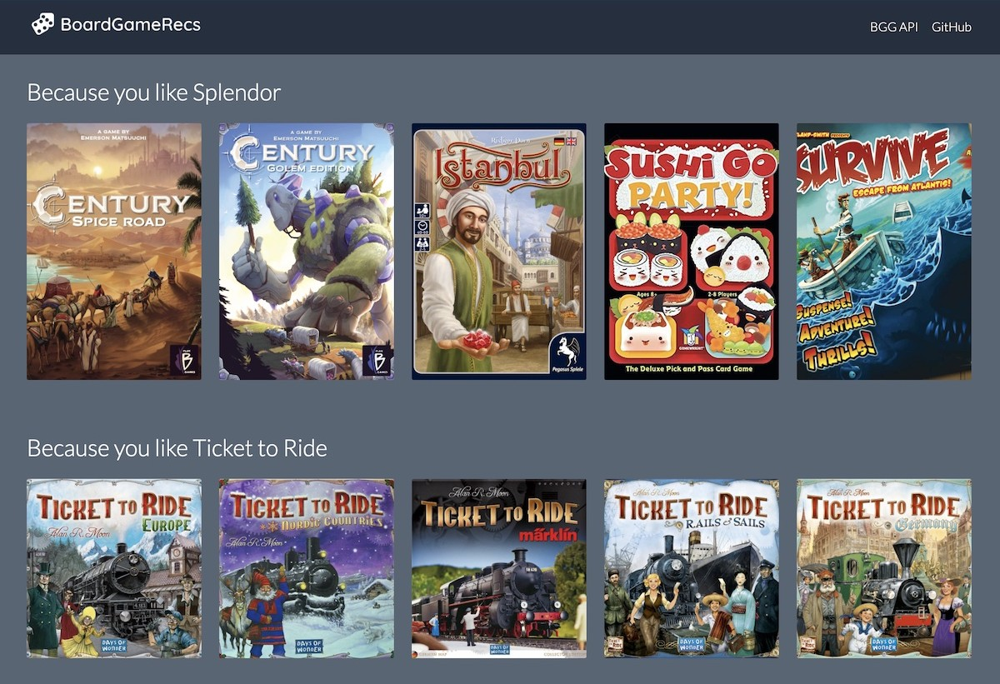

<p align="center">
  <strong><a href="https://cedricblondeau.github.io/board-game-recs/" title="Live demo">✨ Live demo ✨</a></strong>
</p>



# board-game-recs

> Collaborative filtering board game recommendations from [BoardGameGeek](https://boardgamegeek.com/) data 🎲🤖.

[](https://forthebadge.com) [](https://forthebadge.com) [](https://forthebadge.com) [](https://forthebadge.com)

## Live demo

https://cedricblondeau.github.io/board-game-recs/

## Overview

`board-games-recs` is powered by a [collaborative filtering](https://en.wikipedia.org/wiki/Collaborative_filtering) ML model. It uses reviews from users with similar tastes to compute similarity between games.

Model is trained with [FastAI](https://docs.fast.ai/collab.html) which provides great tooling for assembling data. See this [notebook](lab/model.ipynb) for more information.

Recommendations are written to a JSON file and exposed through a [React-based UI](ui). 

## Table of contents

```
lab/            # Jupyter notebooks
ui/             # React demo app
```

## Data source

Model uses this wonderful [Kaggle dataset](https://www.kaggle.com/jvanelteren/boardgamegeek-reviews) from Jesse van Elteren.

Data comes from the awesome [BoardGameGeek XML API](https://boardgamegeek.com/wiki/page/XML_API_Terms_of_Use). It allows reproducing and displaing the data for strictly non-commercial purposes.

## Motivation

Fun and learning. Zero guarantees included.

## Resources

- [Kaggle dataset](https://www.kaggle.com/jvanelteren/boardgamegeek-reviews)
- [BoardGameGeek XML API](https://boardgamegeek.com/wiki/page/BGG_XML_API2)
- [Collaborative filtering with fastai](https://docs.fast.ai/collab.html)
- [Collaborative filtering](https://en.wikipedia.org/wiki/Collaborative_filtering)
